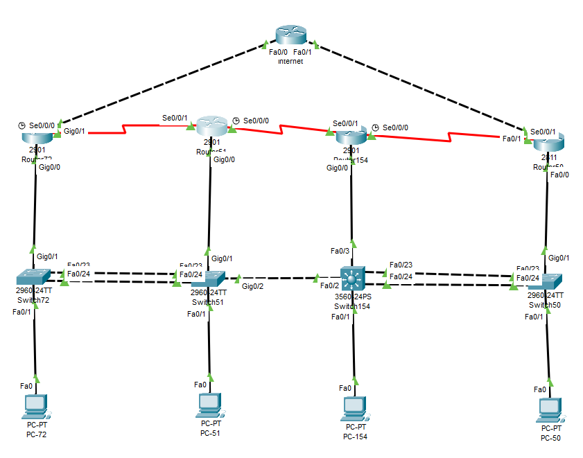

# Final Evaluation #1
 
### Table of Contents
1. [Network Topology](#network-topology)
2. [StudentAA](#studentaa)
   - [RouterAA](#routeraa)
   - [SwitchAA](#switchaa)
3. [StudentBB](#studentbb)
   - [RouterBB](#routerbb)
   - [SwitchBB](#switchbb)
4. [StudentCC](#studentcc)
   - [RouterCC](#routercc)
   - [SwitchCC](#switchcc)
5. [StudentDD](#studentdd)
   - [RouterDD](#routerdd)
   - [SwitchDD](#switchdd)
6. [The Internet](#the-internet)
7. [Reload Equipment](#reload-equipment)
   - [Router](#router)
   - [Switch-2960](#switch-2960)
   - [Switch-3560](#switch-3560)

### Network Topology 
- PLEASE DO NOT USE THIS DIAGRAM FOR YOUR PRE-LAB. THIS IS FOR REFRENCE ONLY!!!

### StudentAA
#### RouterAA
```
en
conf t
hostname Router-72
ip domain-name csn400.com
enable password seneca
!
int gig 0/0
no shut
!
int gig 0/1
ip address 18.0.72.1 255.255.255.252
no shut
ip nat outside
!
int s0/0/0 
ip access-group 110 in
clock rate 56000
ip address 192.168.72.1 255.255.255.252
no shut
!
int gig 0/0.72
encapsulation dot1q 72
ip address 172.16.72.2 255.255.255.0
standby 1 ip 172.16.72.1
standby 1 preempt
standby 1 priority 105
ip access-group 110 in
ip nat inside
!
int gig 0/0.51
encapsulation dot1q 51
ip address 172.16.51.2 255.255.255.0
standby 2 ip 172.16.51.1
standby 2 preempt
standby 2 priority 104
ip access-group 110 in
ip nat inside
!
int gig 0/0.154
encapsulation dot1q 154
ip address 172.16.154.2 255.255.255.0
standby 3 ip 172.16.154.1
standby 3 preempt
standby 3 priority 102
ip access-group 110 in
ip nat inside
!
int gig 0/0.50
encapsulation dot1q 50
ip address 172.16.50.2 255.255.255.0
standby 4 ip 172.16.50.1
standby 4 preempt
standby 4 priority 104
ip access-group 110 in
ip nat inside
!
int gig 0/0.250
encapsulation dot1q 250
ip address 172.16.250.2 255.255.255.0
standby 5 ip 172.16.250.1
standby 5 preempt
standby 5 priority 103
ip access-group 110 in
ip nat inside
!
ip dhcp pool net72
network 172.16.72.0 255.255.255.0
default-router 172.16.72.1
!
ip dhcp pool net51
network 172.16.51.0 255.255.255.0
default-router 172.16.51.1
!
ip dhcp pool net154
network 172.16.154.0 255.255.255.0
default-router 172.16.154.1
!
ip dhcp pool net50
network 172.16.50.0 255.255.255.0
default-router 172.16.50.1
!
ip dhcp excluded-address 172.16.72.1 172.16.72.5
ip dhcp excluded-address 172.16.72.61 172.16.72.254
ip dhcp excluded-address 172.16.51.1 172.16.51.5
ip dhcp excluded-address 172.16.51.61 172.16.51.254
ip dhcp excluded-address 172.16.154.1 172.16.154.5
ip dhcp excluded-address 172.16.154.61 172.16.154.254
ip dhcp excluded-address 172.16.50.1 172.16.50.5
ip dhcp excluded-address 172.16.50.61 172.16.50.254
!
router eigrp 100
network 192.168.72.0 255.255.255.252
network 172.16.72.0 255.255.255.0
network 172.16.51.0 255.255.255.0
network 172.16.154.0 255.255.255.0
network 172.16.50.0 255.255.255.0
redistribute static
!
ip route 0.0.0.0 0.0.0.0 18.0.72.2
!
access-list 110 deny tcp any 192.168.72.0 0.0.0.255 eq 22
access-list 110 deny tcp any 172.16.72.0 0.0.0.255 eq 22
access-list 110 deny tcp any 172.16.51.0 0.0.0.255 eq 22
access-list 110 deny tcp any 172.16.154.0 0.0.0.255 eq 22
access-list 110 deny tcp any 172.16.50.0 0.0.0.255 eq 22
access-list 110 permit ip any any
!
access-list 1 permit 172.16.72.0 0.0.0.255
access-list 1 permit 172.16.51.0 0.0.0.255
access-list 1 permit 172.16.154.0 0.0.0.255
access-list 1 permit 172.16.50.0 0.0.0.255
!
ip nat inside source list 1 int gig 0/1 overload
!
```
***
- SSH
```
!SSH setup script -- run this script separately!
crypto key generate rsa
1024
ip ssh version 2
line vty 0 4
transport input ssh 
login local
username student72 password csn400
username student51 password csn400
username student154 password csn400
username student50 password csn400
exit
```
***

#### SwitchAA
```
en
conf t
hostname Switch-72
ip domain-name csn400.com
enable password seneca
!
vtp mode client
vtp domain student51
!
int fa 0/1
switchport access vlan 72
spanning-tree portfast
spanning-tree bpduguard enable
!
int range fa 0/2 - 22
switchport access vlan 99
spanning-tree portfast
spanning-tree bpduguard enable
!
int gig 0/1
switchport mode trunk
switchport trunk allowed vlan 72,51,154,50,250
!
int range fa 0/23 - 24
channel-protocol lacp
channel-group 1 mode active
!
int po1
switchport mode trunk
switchport trunk allowed vlan 72,51,154,50,99,250
!
int vlan 250
ip address 172.16.250.72 255.255.255.0
no shut
!
ip default-gateway 172.16.250.1
!
```
***
- SSH
```
!SSH setup script -- run this script separately!
crypto key generate rsa
1024
ip ssh version 2
line vty 0 4
transport input ssh 
login local
username student72 password csn400
username student51 password csn400
username student154 password csn400
username student50 password csn400
exit
```
***

### StudentBB

#### RouterBB
```
en
conf t
hostname Router-51
ip domain-name csn400.com
enable password seneca
!
int gig 0/0
no shut
!
int s0/0/1 
ip access-group 110 in
ip address 192.168.72.2 255.255.255.252
no shut
!
int s 0/0/0
clock rate 56000
ip access-group 110 in
ip address 192.168.51.1 255.255.255.252
no shut
!
int gig 0/0.72
encapsulation dot1q 72
ip address 172.16.72.3 255.255.255.0
standby 1 ip 172.16.72.1
standby 1 preempt
standby 1 priority 104
ip access-group 110 in
!
int gig 0/0.51
encapsulation dot1q 51
ip address 172.16.51.3 255.255.255.0
standby 2 ip 172.16.51.1
standby 2 preempt
standby 2 priority 105
ip access-group 110 in
!
int gig 0/0.154
encapsulation dot1q 154
ip address 172.16.154.3 255.255.255.0
standby 3 ip 172.16.154.1
standby 3 preempt
standby 3 priority 103
ip access-group 110 in
!
int gig 0/0.50
encapsulation dot1q 50
ip address 172.16.50.3 255.255.255.0
standby 4 ip 172.16.50.1
standby 4 preempt
standby 4 priority 103
ip access-group 110 in
!
int gig 0/0.250
encapsulation dot1q 250
ip address 172.16.250.3 255.255.255.0
standby 5 ip 172.16.250.1
standby 5 preempt
standby 5 priority 105
ip access-group 110 in
!
ip dhcp pool net72
network 172.16.72.0 255.255.255.0
default-router 172.16.72.1
!
ip dhcp pool net51
network 172.16.51.0 255.255.255.0
default-router 172.16.51.1
!
ip dhcp pool net154
network 172.16.154.0 255.255.255.0
default-router 172.16.154.1
!
ip dhcp pool net50
network 172.16.50.0 255.255.255.0
default-router 172.16.50.1
!
ip dhcp excluded-address 172.16.72.1 172.16.72.60
ip dhcp excluded-address 172.16.72.121 172.16.72.254
ip dhcp excluded-address 172.16.51.1 172.16.51.60
ip dhcp excluded-address 172.16.51.121 172.16.51.254
ip dhcp excluded-address 172.16.154.1 172.16.154.60
ip dhcp excluded-address 172.16.154.121 172.16.154.254
ip dhcp excluded-address 172.16.50.1 172.16.50.60
ip dhcp excluded-address 172.16.50.121 172.16.50.254
!
router eigrp 100
network 192.168.72.0 255.255.255.252
network 192.168.51.0 255.255.255.252
network 172.16.72.0 255.255.255.0
network 172.16.51.0 255.255.255.0
network 172.16.154.0 255.255.255.0
network 172.16.50.0 255.255.255.0
!
access-list 110 deny tcp any 192.168.72.0 0.0.0.255 eq 22
access-list 110 deny tcp any 172.16.72.0 0.0.0.255 eq 22
access-list 110 deny tcp any 172.16.51.0 0.0.0.255 eq 22
access-list 110 deny tcp any 172.16.154.0 0.0.0.255 eq 22
access-list 110 deny tcp any 172.16.50.0 0.0.0.255 eq 22
access-list 110 permit ip any any
!
```
***
- SSH
```
!SSH setup script -- run this script separately!
crypto key generate rsa
1024
ip ssh version 2
line vty 0 4
transport input ssh 
login local
username student72 password csn400
username student51 password csn400
username student154 password csn400
username student50 password csn400
exit
```
***

#### SwitchBB
```
en
conf t
hostname Switch-51
ip domain-name csn400.com
enable password seneca
!
vtp mode server
vtp domain student51
!
vlan 72
vlan 51
vlan 154
vlan 50
vlan 99
vlan 250
!
spanning-tree vlan 1 root primary
!
int fa 0/1
switchport access vlan 51
spanning-tree portfast
spanning-tree bpduguard enable
!
int range fa 0/2 - 22
switchport access vlan 99
spanning-tree portfast
spanning-tree bpduguard enable
!
int gig 0/1
switchport mode trunk
switchport trunk allowed vlan 72,51,154,50,250
!
int gig 0/2
switchport mode trunk
switchport trunk allowed vlan 72,51,154,50,250
!
int range fa 0/23 - 24
channel-protocol lacp
channel-group 1 mode active
!
int po1
switchport mode trunk
switchport trunk allowed vlan 72,51,154,50,250
!
int vlan 250
ip address 172.16.250.51 255.255.255.0
no shut
!
ip default-gateway 172.16.250.1
!
```
***
- SSH
```
!SSH setup script -- run this script separately!
crypto key generate rsa
1024
ip ssh version 2
line vty 0 4
transport input ssh 
login local
username student72 password csn400
username student51 password csn400
username student154 password csn400
username student50 password csn400
exit
```
***
### StudentCC
#### RouterCC
```
en
conf t
hostname Router-154
ip domain-name csn400.com
enable password seneca
!
int gig 0/0
no shut
!
int s0/0/1 
ip access-group 110 in
ip address 192.168.51.2 255.255.255.252
no shut
!
int s 0/0/0
clock rate 56000
ip access-group 110 in
ip address 192.168.154.1 255.255.255.252
no shut
!
int gig 0/0.72
encapsulation dot1q 72
ip address 172.16.72.4 255.255.255.0
standby 1 ip 172.16.72.1
standby 1 preempt
standby 1 priority 103
ip access-group 110 in
!
int gig 0/0.51
encapsulation dot1q 51
ip address 172.16.51.4 255.255.255.0
standby 2 ip 172.16.51.1
standby 2 preempt
standby 2 priority 103
ip access-group 110 in
!
int gig 0/0.154
encapsulation dot1q 154
ip address 172.16.154.4 255.255.255.0
standby 3 ip 172.16.154.1
standby 3 preempt
standby 3 priority 105
ip access-group 110 in
!
int gig 0/0.50
encapsulation dot1q 50
ip address 172.16.50.4 255.255.255.0
standby 4 ip 172.16.50.1
standby 4 preempt
standby 4 priority 104
ip access-group 110 in
!
int gig 0/0.250
encapsulation dot1q 250
ip address 172.16.250.4 255.255.255.0
standby 5 ip 172.16.250.1
standby 5 preempt
standby 5 priority 104
ip access-group 110 in
!
ip dhcp pool net72
network 172.16.72.0 255.255.255.0
default-router 172.16.72.1
!
ip dhcp pool net51
network 172.16.51.0 255.255.255.0
default-router 172.16.51.1
!
ip dhcp pool net154
network 172.16.154.0 255.255.255.0
default-router 172.16.154.1
!
ip dhcp pool net50
network 172.16.50.0 255.255.255.0
default-router 172.16.50.1
!
ip dhcp excluded-address 172.16.72.1 172.16.72.120
ip dhcp excluded-address 172.16.72.181 172.16.72.254
ip dhcp excluded-address 172.16.51.1 172.16.51.120
ip dhcp excluded-address 172.16.51.181 172.16.51.254
ip dhcp excluded-address 172.16.154.1 172.16.154.120
ip dhcp excluded-address 172.16.154.181 172.16.154.254
ip dhcp excluded-address 172.16.50.1 172.16.50.120
ip dhcp excluded-address 172.16.50.181 172.16.50.254
!
router eigrp 100
network 192.168.51.0 255.255.255.252
network 192.168.154.0 255.255.255.252
network 172.16.72.0 255.255.255.0
network 172.16.51.0 255.255.255.0
network 172.16.154.0 255.255.255.0
network 172.16.50.0 255.255.255.0
!
```
```
access-list 110 deny tcp any 192.168.72.0 0.0.0.255 eq 22
access-list 110 deny tcp any 172.16.72.0 0.0.0.255 eq 22
access-list 110 deny tcp any 172.16.51.0 0.0.0.255 eq 22
access-list 110 deny tcp any 172.16.154.0 0.0.0.255 eq 22
access-list 110 deny tcp any 172.16.50.0 0.0.0.255 eq 22
access-list 110 permit ip any any
!
```
***
- SSH
```
!SSH setup script -- run this script separately!
crypto key generate rsa
1024
ip ssh version 2
line vty 0 4
transport input ssh 
login local
username student72 password csn400
username student51 password csn400
username student154 password csn400
username student50 password csn400
exit
```
***

#### SwitchCC
```
en
conf t
hostname Switch-154
ip domain-name csn400.com
enable password seneca
!
vtp mode server
vtp domain student51
!
vlan 72
vlan 51
vlan 154
vlan 50
vlan 99
vlan 250
!
spanning-tree vlan 1 root secondary
!
int fa 0/1
switchport access vlan 154
spanning-tree portfast
spanning-tree bpduguard enable
!
int range fa 0/4 - 22
switchport access vlan 99
spanning-tree portfast
spanning-tree bpduguard enable
!
int fa 0/2
switchport trunk encapsulation dot1q
switchport mode trunk
switchport trunk allowed vlan 72,51,154,50,250
!
int fa 0/3
switchport trunk encapsulation dot1q
switchport mode trunk
switchport trunk allowed vlan 72,51,154,50,250
!
int range fa 0/23 - 24
channel-protocol lacp
channel-group 1 mode active
!
int po1
switchport trunk encapsulation dot1q
switchport mode trunk
switchport trunk allowed vlan 72,51,154,50,250
!
int vlan 250
ip address 172.16.250.154 255.255.255.0
no shut
!
ip default-gateway 172.16.250.1
!
```
***
- SSH
```
!SSH setup script -- run this script separately!
crypto key generate rsa
1024
ip ssh version 2
line vty 0 4
transport input ssh 
login local
username student72 password csn400
username student51 password csn400
username student154 password csn400
username student50 password csn400
exit
```
***
### StudentDD
#### RouterDD
```
en
conf t
hostname Router-50
ip domain-name csn400.com
enable password seneca
!
int fa 0/0
no shut
!
int fa 0/1
ip nat outside
ip address 18.0.50.1 255.255.255.252
no shut
!
int s0/0/1 
ip access-group 110 in
ip address 192.168.154.2 255.255.255.252
no shut
!
int fa 0/0.72
ip nat inside
encapsulation dot1q 72
ip address 172.16.72.5 255.255.255.0
standby 1 ip 172.16.72.1
standby 1 preempt
standby 1 priority 102
ip access-group 110 in
!
int fa 0/0.51
ip nat inside
encapsulation dot1q 51
ip address 172.16.51.5 255.255.255.0
standby 2 ip 172.16.51.1
standby 2 preempt
standby 2 priority 102
ip access-group 110 in
!
int fa 0/0.154
ip nat inside
encapsulation dot1q 154
ip address 172.16.154.5 255.255.255.0
standby 3 ip 172.16.154.1
standby 3 preempt
standby 3 priority 104
ip access-group 110 in
!
int fa 0/0.50
ip nat inside
encapsulation dot1q 50
ip address 172.16.50.5 255.255.255.0
standby 4 ip 172.16.50.1
standby 4 preempt
standby 4 priority 105
ip access-group 110 in
!
int fa 0/0.250
encapsulation dot1q 250
ip address 172.16.250.5 255.255.255.0
standby 5 ip 172.16.250.1
standby 5 preempt
standby 5 priority 102
ip access-group 110 in
!
ip dhcp pool net72
network 172.16.72.0 255.255.255.0
default-router 172.16.72.1
!
ip dhcp pool net51
network 172.16.51.0 255.255.255.0
default-router 172.16.51.1
!
ip dhcp pool net154
network 172.16.154.0 255.255.255.0
default-router 172.16.154.1
!
ip dhcp pool net50
network 172.16.50.0 255.255.255.0
default-router 172.16.50.1
!
ip dhcp excluded-address 172.16.72.1 172.16.72.180
ip dhcp excluded-address 172.16.72.244 172.16.72.254
ip dhcp excluded-address 172.16.51.1 172.16.51.180
ip dhcp excluded-address 172.16.51.244 172.16.51.254
ip dhcp excluded-address 172.16.154.1 172.16.154.180
ip dhcp excluded-address 172.16.154.244 172.16.154.254
ip dhcp excluded-address 172.16.50.1 172.16.50.180
ip dhcp excluded-address 172.16.50.244 172.16.50.254
!
router eigrp 100
network 192.168.154.0 255.255.255.252
network 172.16.72.0 255.255.255.0
network 172.16.51.0 255.255.255.0
network 172.16.154.0 255.255.255.0
network 172.16.50.0 255.255.255.0
!
```
```
access-list 110 deny tcp any 192.168.72.0 0.0.0.255 eq 22
access-list 110 deny tcp any 172.16.72.0 0.0.0.255 eq 22
access-list 110 deny tcp any 172.16.51.0 0.0.0.255 eq 22
access-list 110 deny tcp any 172.16.154.0 0.0.0.255 eq 22
access-list 110 deny tcp any 172.16.50.0 0.0.0.255 eq 22
access-list 110 permit ip any any
!
access-list 1 permit 172.16.72.0 0.0.0.255
access-list 1 permit 172.16.51.0 0.0.0.255
access-list 1 permit 172.16.154.0 0.0.0.255
access-list 1 permit 172.16.50.0 0.0.0.255
!
ip nat inside source list 1 int fa 0/1 overload
!
```
***
- SSH 
```
!SSH setup script -- run this script separately!
crypto key generate rsa
1024
ip ssh version 2
line vty 0 4
transport input ssh 
login local
username student72 password csn400
username student51 password csn400
username student154 password csn400
username student50 password csn400
exit
```
***

#### SwitchDD
```
en
conf t
hostname Switch-50
ip domain-name csn400.com
enable password seneca
!
vtp mode client
vtp domain student51
!
int fa 0/1
switchport access vlan 50
spanning-tree portfast
spanning-tree bpduguard enable
!
int range fa 0/2 - 22
switchport access vlan 99
spanning-tree portfast
spanning-tree bpduguard enable
!
int gig 0/1
switchport mode trunk
switchport trunk allowed vlan 72,51,154,50,250
!
int range fa 0/23 - 24
channel-protocol lacp
channel-group 1 mode active
!
int po1
switchport mode trunk
switchport trunk allowed vlan 72,51,154,50,99,250
!
int vlan 250
ip address 172.16.250.50 255.255.255.0
no shut
!
ip default-gateway 172.16.250.1
!
```
***
- SSH
```
!SSH setup script -- run this script separately!
crypto key generate rsa
1024
ip ssh version 2
line vty 0 4
transport input ssh 
login local
username student72 password csn400
username student51 password csn400
username student154 password csn400
username student50 password csn400
exit
```
***
### The Internet
```
en
conf t
int fa 0/0
ip address 18.0.72.2 255.255.255.252
no shut
ip access-group 120 in
!
int fa 0/1
ip address 18.0.50.2 255.255.255.252
no shut
ip access-group 120 in
!
int lo1
ip address 200.100.50.1 255.255.255.0
no shut
!
access-list 120 deny ip 172.16.0.0 0.15.255.255 any
access-list 120 deny ip 192.168.0.0 0.0.255.255 any
access-list 120 permit ip any any
!
ip route 0.0.0.0 0.0.0.0 fa 0/0
ip route 0.0.0.0 0.0.0.0 fa 0/1 50
```
### Reload Equipment
#### Router
- Commands
```
erase startup-config
```
```
reload
```
#### Switch 2960
- Commands
```
delete vlan.dat
```
```
erase nvram:
```
```
reload
```

#### Switch 3560
- Commands
```
delete vlan.dat
```
```
write erase
```
```
reload
```


